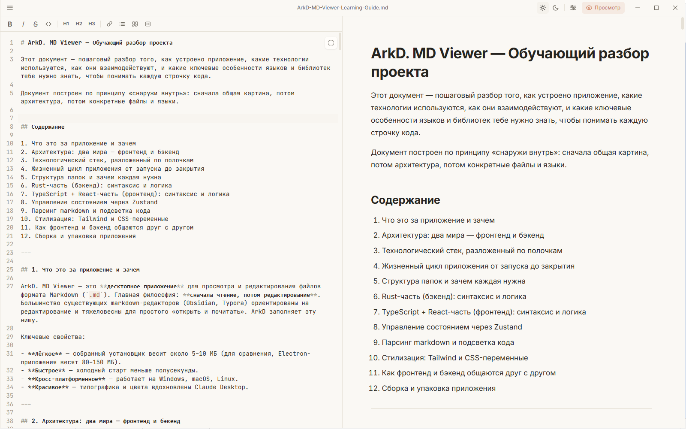
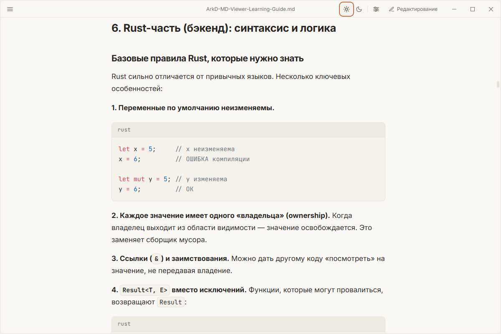
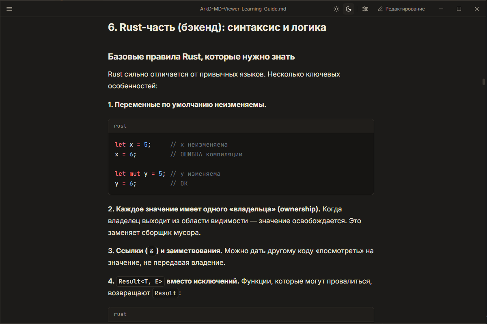
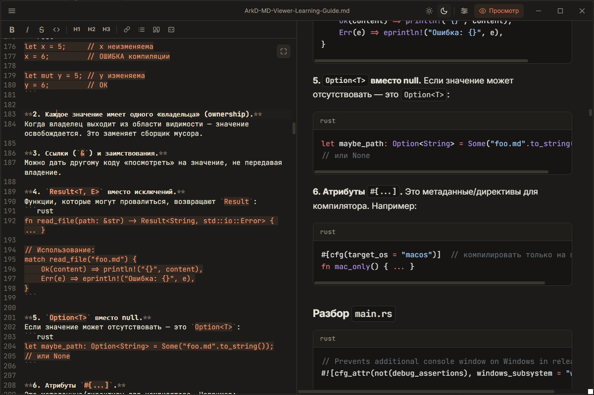
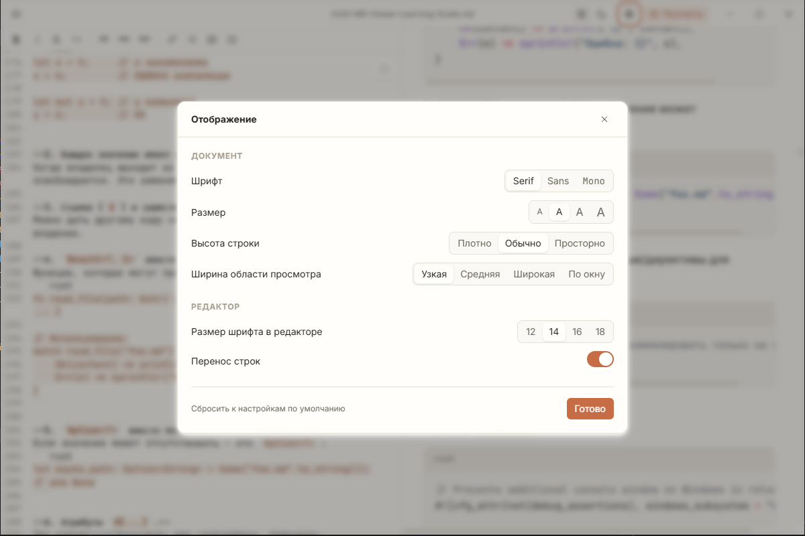

<div align="center">
  

  <h1>ArkD. MD Viewer</h1>

  <p>
    <strong>Fast, lightweight Markdown viewer with on-demand editing.</strong><br>
    Built with Tauri 2 — installer under 4 MB, sub-second cold start.
  </p>

  <p>
    <a href="https://github.com/ArkDdev/ArkD-MD-Viewer/releases/latest"></a>
    <a href="https://github.com/ArkDdev/ArkD-MD-Viewer/actions/workflows/ci.yml"></a>
    <a href="LICENSE"></a>
    
    
  </p>

  <p>
    <a href="https://github.com/ArkDdev/ArkD-MD-Viewer/releases/latest">⬇ Download (Windows / Linux)</a>
    ·
    <a href="#features">Features</a>
    ·
    <a href="#screenshots">Screenshots</a>
    ·
    <a href="README.ru.md">🇷🇺 Русский</a>
  </p>
</div>

<br>

<!-- Replace with a real screenshot of the app once you have it -->
<p align="center">
  
</p>

---

## Why ArkD?

Most Markdown editors are huge — Obsidian is around 150 MB, Typora ~70 MB, MarkText ~120 MB. They all bundle a copy of Chromium, even though the operating system already ships one.

ArkD. MD Viewer is **3.3 MB** because it uses Tauri 2 and your system's WebView. It does the few things a Markdown viewer should do, very well, and gets out of the way.

## Features

- 📄 **Read and edit** — toggle between rendered preview, side-by-side split, and full-screen edit
- 🎨 **Light, dark, and system themes** — switch instantly with `☀ ☾`
- 🔄 **External file watcher** — when a file changes outside the app, ArkD reloads it (or asks first if you have unsaved edits)
- 🪂 **Drag & drop** — drop a `.md` file on the window to open it
- ⌨️ **Keyboard shortcuts that work on any layout** — `Ctrl+S` works on Russian `Ctrl+Ы` too (matches physical keys, not characters)
- 🔤 **Bundled fonts** — Inter, Source Serif 4, JetBrains Mono ship with the app
- 🎛 **Customisable display** — font family, size, line height, reading width
- 🌍 **Russian and English UI** — auto-detected from the system
- 🎨 **Code syntax highlighting** via Shiki (with language label)
- 📎 **File associations** — open `.md` files from Explorer with one double-click
- 🚀 **Tiny and fast** — installer 3-4 MB, cold start under a second

## Screenshots

<table>
<tr>
<td align="center"><b>Light theme</b></td>
<td align="center"><b>Dark theme</b></td>
</tr>
<tr>
<td></td>
<td></td>
</tr>
<tr>
<td align="center"><b>Edit mode (split view)</b></td>
<td align="center"><b>Display settings</b></td>
</tr>
<tr>
<td></td>
<td></td>
</tr>
</table>

## Install

### Windows

Download the latest installer from the [Releases page](https://github.com/ArkDdev/ArkD-MD-Viewer/releases/latest):

- **NSIS installer** (`.exe`) — recommended for personal use, offers language selection during install
- **MSI installer** (`.msi`) — for corporate environments using Group Policy

Both installers register `.md`, `.markdown`, `.mdx`, and `.mkd` file associations system-wide.

### macOS / Linux

Coming soon — planned via GitHub Actions builds.

## Keyboard shortcuts

| Action | Shortcut |
|---|---|
| New file | `Ctrl+N` |
| Open file | `Ctrl+O` |
| Save | `Ctrl+S` |
| Save as | `Ctrl+Shift+S` |
| Toggle edit / preview | `Ctrl+E` |
| Settings | `Ctrl+,` |

All shortcuts use **physical key codes**, so they work identically on any keyboard layout — including Cyrillic.

## Tech stack

- **[Tauri 2](https://tauri.app/)** — Rust backend with system WebView2 (no Electron)
- **[React 18](https://react.dev/)** + **[TypeScript](https://www.typescriptlang.org/)** — UI layer
- **[Vite 5](https://vitejs.dev/)** — frontend bundling
- **[CodeMirror 6](https://codemirror.net/)** — editor
- **[markdown-it](https://github.com/markdown-it/markdown-it)** — markdown parsing
- **[Shiki](https://shiki.style/)** — syntax highlighting (TextMate grammars, lazy-loaded)
- **[Tailwind CSS 3](https://tailwindcss.com/)** — styling
- **[Zustand](https://zustand-demo.pmnd.rs/)** — state management
- **[notify](https://github.com/notify-rs/notify)** + **[notify-debouncer-mini](https://crates.io/crates/notify-debouncer-mini)** — file watching (Rust)

## Build from source

Requires:

- **Node.js** 18+ and **npm**
- **Rust** (latest stable) via [rustup](https://rustup.rs/)
- **Microsoft C++ Build Tools** on Windows
- **WebView2 Runtime** (preinstalled on Windows 11; auto-installed by NSIS)

```sh
git clone https://github.com/ArkDdev/ArkD-MD-Viewer.git
cd ArkD-MD-Viewer
npm install
npm run tauri:dev      # development with hot reload
npm run tauri:build    # production installers
```

Output goes into `src-tauri/target/release/bundle/` — NSIS installers in `nsis/`, MSI installers in `msi/`.

## Roadmap

- [ ] macOS and Linux builds via GitHub Actions
- [ ] Recent files menu
- [ ] Table of contents sidebar
- [ ] Find & replace within a document
- [ ] Support for `.txt`, `.json`, `.ini` files (editor-only mode)
- [ ] Auto-update via GitHub Releases

Have a request or idea? [Open an issue](https://github.com/ArkDdev/ArkD-MD-Viewer/issues) or start a [discussion](https://github.com/ArkDdev/ArkD-MD-Viewer/discussions).

## License

[MIT](LICENSE) — Copyright © 2026 Arkadiy Karanskiy (ArkD.DEV)

You are free to use, modify, and distribute ArkD. MD Viewer, including for commercial purposes. The only requirement is to keep the copyright notice in derivative works.

---

<div align="center">
  Made by <a href="https://github.com/ArkDdev"><b>ArkDdev</b></a>
</div>
